Стек технологий: Spring boot, Thymeleaf, Bootstrap, Hibernate, PostgreSql 

1. Cхема таблицы item с полями id, description, created, done. Расположение /db/
   Скрипт загружать через liquibase.
2. Виды.
    - Страница со списком всех заданий. В таблице отображаем имя, дату создания и состояние (выполнено или нет)
    - На странице со списком добавить кнопку "Добавить задание".
    - На странице со списком добавьте три ссылки: Все, Выполненные, Новые. При перевода по ссылкам в таблице нужно отображать: все задания, только выполненные или только новые.
    - При клике на задание переходим на страницу с подробным описанием.
    - На странице с подробным описанием добавить кнопки:Отредактировать, Удалить.
    - Кнопка редактировать переводит пользователя на отдельную страницу для редактирования.
    - Кнопка удалить, удаляет задание и переходит на список всех заданий.

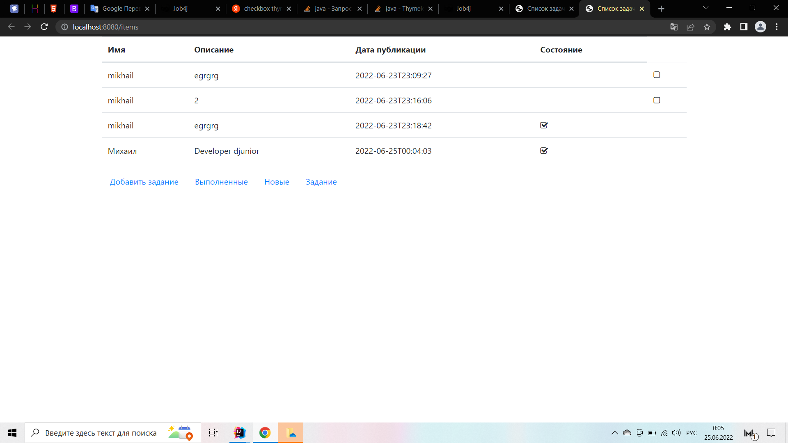
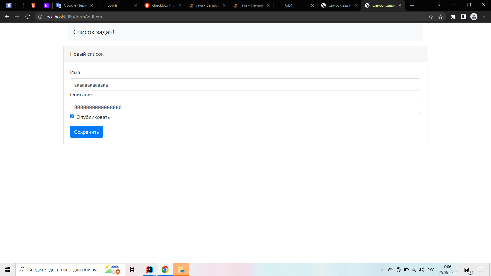
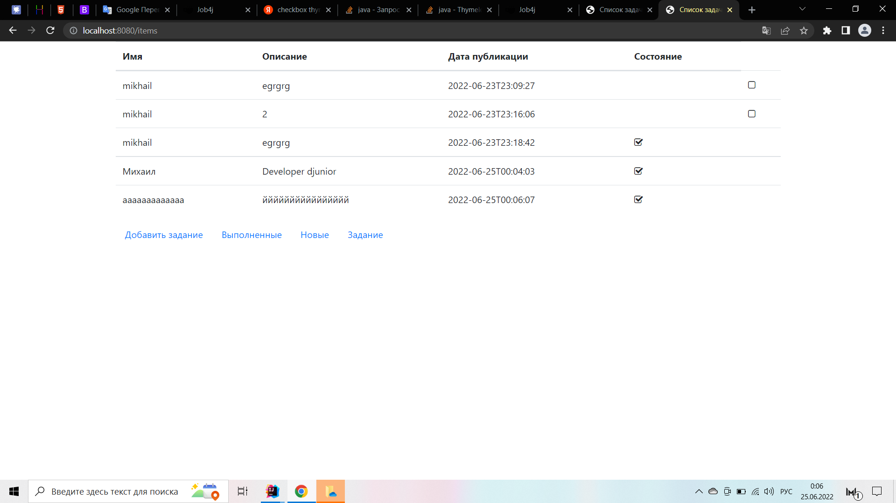

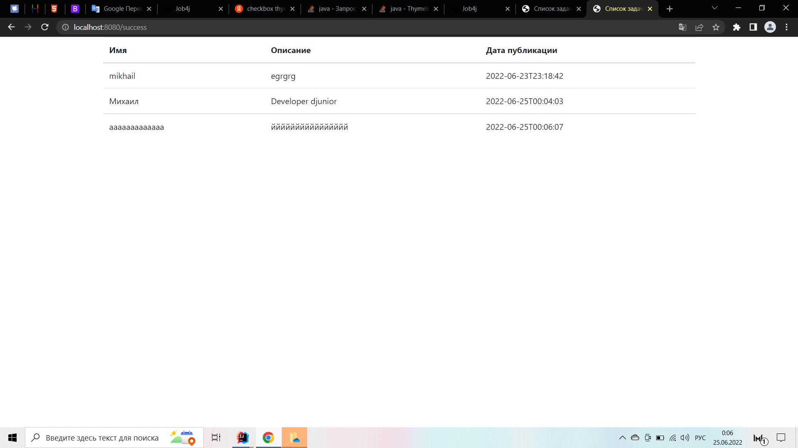
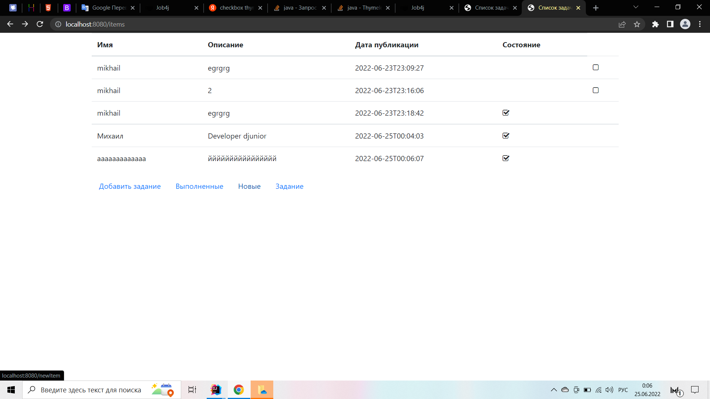
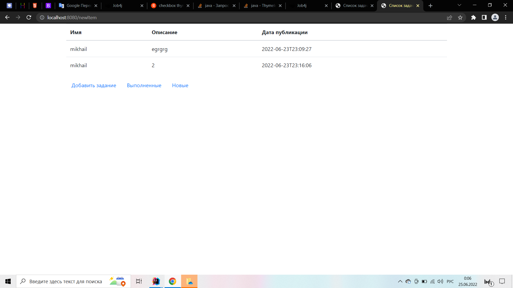

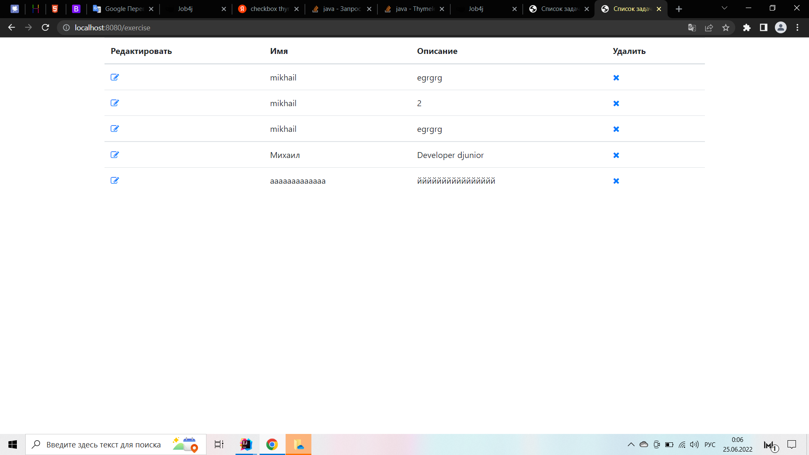
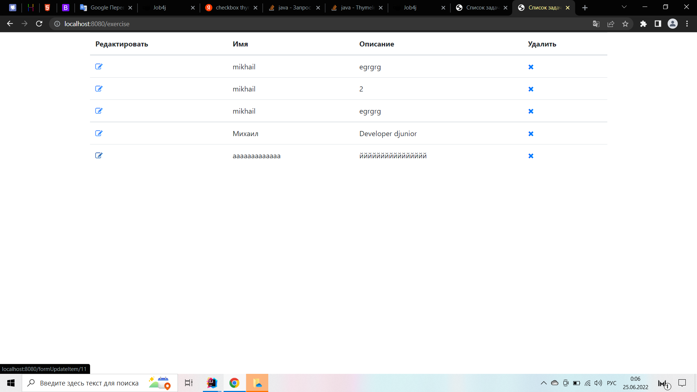
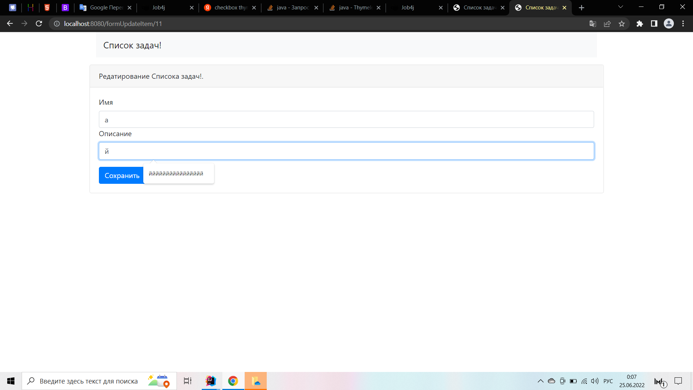

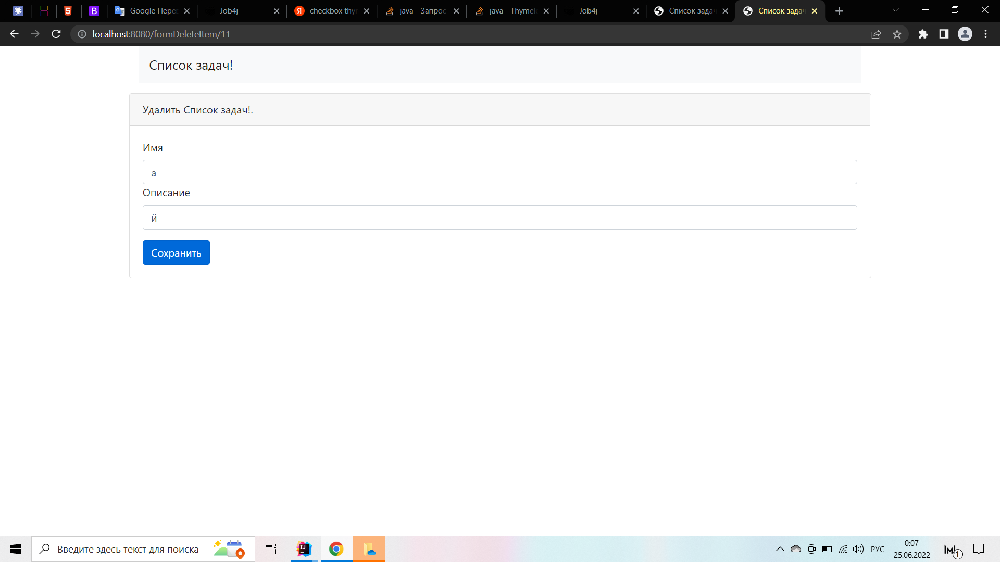
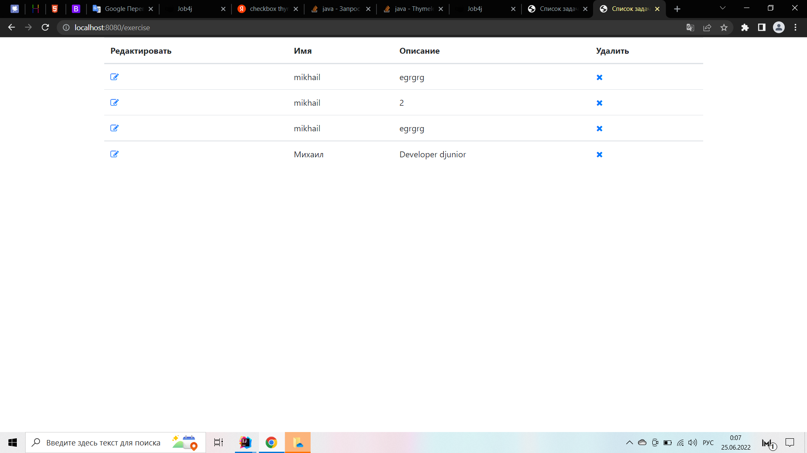